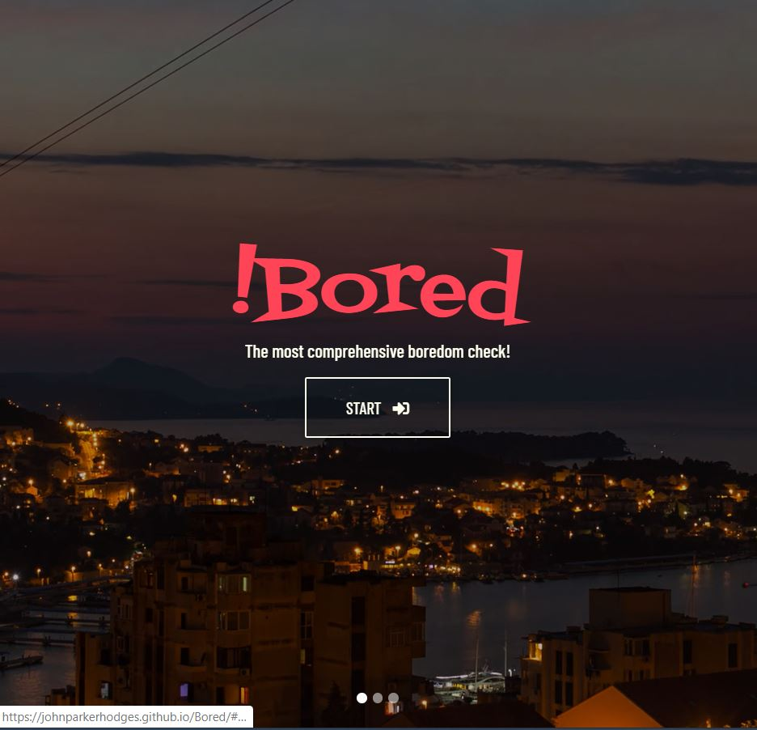

# [!Bored](https://johnparkerhodges.github.io/Bored/)

## Description
The purpose of this project was to utilize a new CSS framework that we haven't used in the past (so not Bootstrap) and server-side APIs to create an interactive application that addresses a problem of our choosing.

> **User story:**
> As a member of my community,
> I want to be able to find various things to do,
> so that I can fully enjoy living here.

!Bored allows the user to enter a zip code and then displays all upcoming events in that location to solve their boredom.

Relevant class concepts: Teamwork in Agile Web Development, Server-Side APIs, CSS Frameworks, Using GitHub in a collaborative fashion

!Bored is a collaborative project by [Adam](https://github.com/adam-lowe), [Jean](https://github.com/jtubay), [Laurie](https://github.com/lbernadel) and [Parker](https://github.com/JohnParkerHodges)

We chose the following framework and APIs:
1. Material Design for Bootstrap(MDB)
2. Google Maps: Places API & Maps API
3. Eventful
4. Ticketmaster's Discovery API

**Extra features we added:**
- Ability to filter events by the categories of Shows, Sports, Festivals, Music, Movies, and Food.
- User Profiles with the ability to sign in/log out, choose a visual theme for the site, saved events list
- Using local storage as a way to create sign in/out options, save events and remember the user's name

## Challenges
- Focusing on the MVP...lots of time spent on the functionality of icebox features, which lead to superfluous frustration and breaking the MVP twice.
- Understanding complex documentation for the Google APIs and the MDB framework
- Getting the information to display properly in our results cards
- Implementing our own color scheme to all elements

### Sources
1. Google Maps: [Maps](https://developers.google.com/maps/documentation/javascript/) API & [Places](https://developers.google.com/places/web-service/) API Documentation
2. [Eventful](https://api.eventful.com/docs) API documentation
3. [Ticketmaster Discovery](https://developer.ticketmaster.com/products-and-docs/apis/discovery-api/v2/) API documentation
4. Front-End Design
   * Guidelines - [Material Design Documentation](https://material.io/design/)
   * CSS framework - [MDB Documentation](https://mdbootstrap.com/docs/jquery/)
   * Color Scheme Tool - [Coolors](https://coolors.co/)
   * Typography Fonts - [Google Fonts](https://fonts.google.com/)

### Future Development (Embrace the ICEBOX!)
- Implement the geolocation feature in such a way that if a user chooses to opt-in rather than type a zip code, it progress but if not, it directs them to the input field for a zip code instead if they decide to block geolocation.
- Ability to search by city while avoiding mix ups between cities in multiple states that have the same name.
- Further filtering by location radius, date and time, other event categories, free vs. paid events, etc.
- Ability to have a password & change the password
- Posting to social media accounts via the application
- History of attended events
- FAQ/Troubleshooting Information
- Functional links to real company social media accounts
- Functional Contact page that users can submit feedback on app functionality (forwarded to GitHub as issues?)